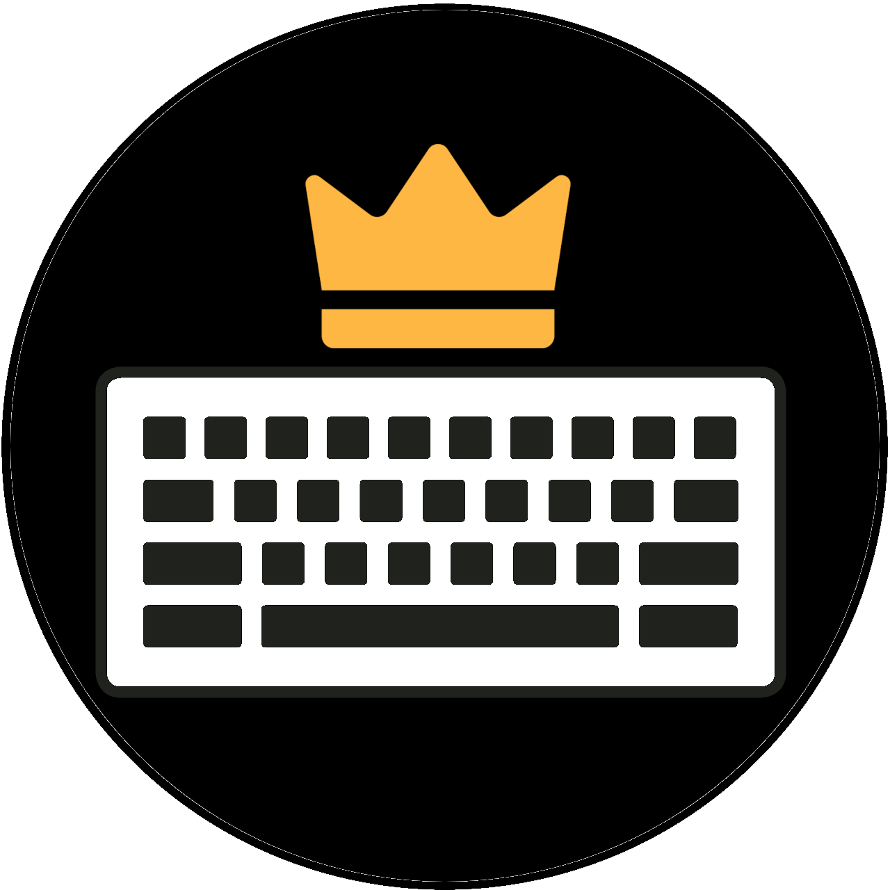

#  KBMSTR - Personalized Keyboards

###  Table of Contents
**[Visit the Official Website!](href)** 
**[Introduction](#introduction)** 
**[Assumptions](#assumptions)** 
**[Installation](#installation)** 
**[Creating a Keyboard](#creating-a-keyboard)** 
**[Pre-made Keyboards](#pre-made-keyboards)** 
**[Practice New Keyboards](#practice-new-keyboards)** 

##  Introduction
KBMSTER provides an array of tools for a user to find the best layout of a keyboard for their own personalized use.
By utilizing these tools, a user is able to collect data on actual typing habits and in turn use this data to generate
a keyboard layout to their exact needs. The goal of a generating a layout is to minimize the finger travel distance when
using a keyboard to type. The beauty of this tool is that it considers various methods of typing and furthermore
will prove useful to anyone looking to improve their typing efficiency. The development process of a brand new keyboard
layout, personalized to an individual, is involved, yet simple. KBMSTR first works with the user to collect actual keystrokes
from the user in a transparent and non-invasive way by utilizing [KBMSTR's data collection tool](link-to-website).
Once a sufficient amount of data is collected and the user utilizes [KBMSTR's configuration tool](link-to-website) to let the algorithm know
actual typing habits, KBMSTR will then utilize these two items to employ a genetic algorithm to find the absolute best keyboard layout
for you. This, paired with [KBMSTR's practice tool](link-to-website) allow for users to dramaically speed up their typinf speeds
and reduce hand fatigue while using the computer.

###  Assumptions
KBMSTR makes a couple assumptions while generating keyboard layouts.

##  Installation
To get started, clone this Repo:

    git clone https://github.com/noahjkrueger/KBMSTR.git

You can also download the zip. Once you have the files unzipped, navigate to /python/

    cd KBMSTR/python

And install the required libraries:

    pip install -r requirements.txt

And that's it! You are ready to start using the tools!

##  Creating a Keyboard
### Getting a Dataset
Generating a keyboard needs data. We recommend using collect_data.py, but you can provide the data in other ways. We reccomend
a dataset with at least 1 million (1,000,000) character, but the more the merrier[**](#using-kbmstrpy).
#### Using collect_data.py
This is probably the best way to provide the KBMSTR tool the data it needs. It is simple, non-invasive, and the most accurate
to your use of the keyboard. To use this tool, navigate to the /python/ directory and type the command:

    python3 collect_data.py

A process will start and every key you type will be recorded. **DO NOT UPLOAD THIS DATA ANYWHERE** - KBMSTR takes privacy very
seriously. The data collected could possibly contain some sensitive information, such as _passwords_ and _personal information_.
This data collected is intended for use in the KBMSTR genetic algorithm, and we do not send this data to _anyone_, not
even ourselves; this data does **not** leave your computer. We highly recommend the deletion of this data once a personalized
keyboard layout is generated.

#### Not using collect_data.py

### Using KBMSTR.py

    > python3 KBMSTR.py [-h] [-config CONFIG] [-dataset DATASET] [-char_checkpoint SIZE] [-name NAME] [-gen_size SIZE] [-mutation_rate RATE] [-epsilon EPSILON] [-steps_to_converge STEPS] [-save_stats] [-analyze] [-display] keyboard

Important info about config and data (breif)
##### Arguments
###### -config
This is very important.

### Creating a Configuration File
#### generate_config.py
use

##  Pre-made Keyboards
### Dataset Sources
- https://www.gutenberg.org/
### Included Keyboards
- **QWERTY** - Standard
- **DVORAK** - Less common
- **SHAKESPEAR**
- **ENGLISH**
- **JAVA**

##  Practice New Keyboards
go to website here is more explanation