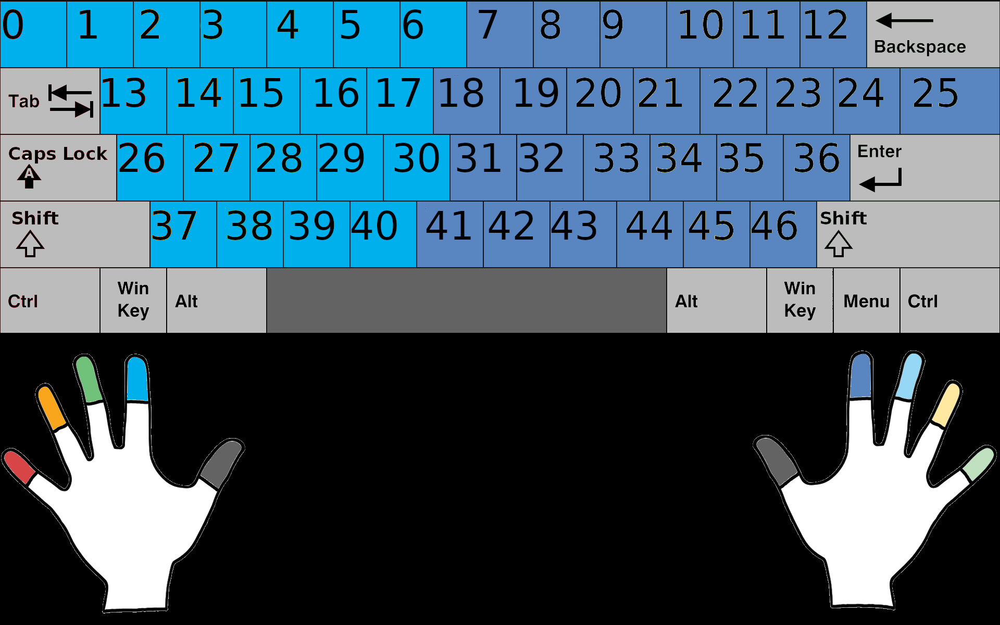
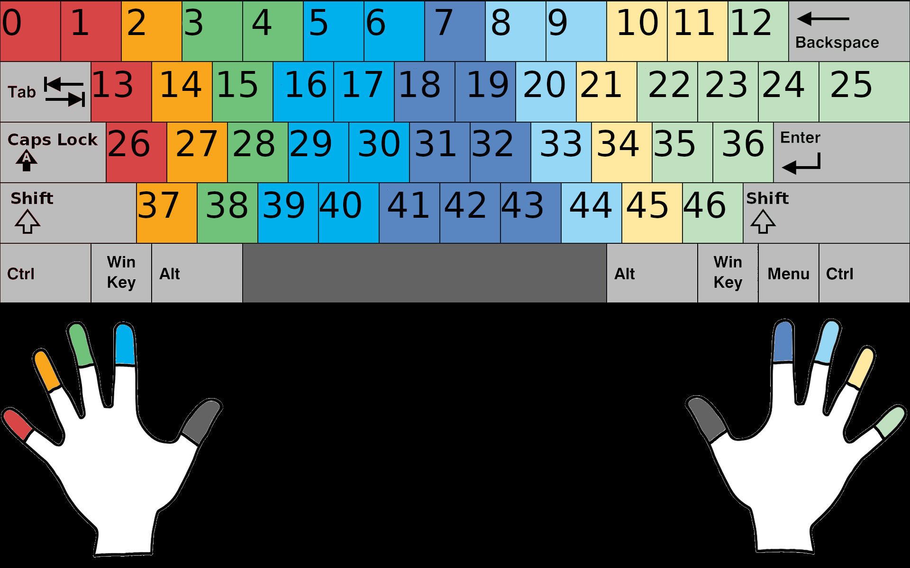

#  KBMSTR - Personalized Keyboards

#  Table of Contents
**[Visit the Official Website!](href)** 
**[Introduction](#introduction)** 
**[Assumptions](#assumptions)** 
**[Installation](#installation)** 
**[Creating a Keyboard](#creating-a-keyboard)** 
**[Pre-made Keyboards](#pre-made-keyboards)** 
**[Practice New Keyboards](#practice-new-keyboards)** 

#  Introduction

KBMSTER provides an array of tools for a user to find the best layout of a keyboard for their own personalized use.
By utilizing these tools, a user is able to collect data on actual typing habits and in turn use this data to generate
a keyboard layout to their exact needs. The goal of a generating a layout is to minimize the finger travel distance when
using a keyboard to type. The beauty of this tool is that it considers various methods of typing and furthermore
will prove useful to anyone looking to improve their typing efficiency. The development process of a brand new keyboard
layout, personalized to an individual, is involved, yet simple. KBMSTR works with the user to collect actual keystrokes
from the user in a transparent and non-invasive way by utilizing [KBMSTR's data collection tool](link-to-website).
Once a sufficient amount of data is collected and the user utilizes [KBMSTR's configuration tool](link-to-website) to let the algorithm know
actual typing habits, KBMSTR will then utilize these two items to employ a genetic algorithm to find the absolute best keyboard layout
for you. This, paired with [KBMSTR's practice tool](link-to-website) allow for users to dramatically speed up their typing speeds
and reduce hand fatigue while using the computer.

#  Installation

To get started, clone this repo:

    git clone https://github.com/noahjkrueger/KBMSTR.git

You can also download the .zip archive. Once you have the files unzipped, navigate to /python/

    cd KBMSTR/python

And install the required libraries:

    pip install -r requirements.txt

And that's it! You are ready to start using the tools!

#  Creating a Keyboard

## Getting a Dataset

Generating a keyboard needs data. We recommend using collect_data.py, but you can provide the data in other ways. We reccomend
a dataset with at least 1 million (1,000,000) character, but the more the merrier[**](#generating-the-keyboard).

### Using collect_data.py

This is probably the best way to provide the KBMSTR tool the data it needs. It is simple, non-invasive, and the most accurate
to your use of the keyboard. We recommend creating a directory to store your data. Navigate to the /python/ directory and type the command:
    
    mkdir my_data && mv collect_data.py my_data && python3 my_data/collect_data.py

A process will start and every key you type will be recorded. **DO NOT UPLOAD THIS DATA ANYWHERE** - KBMSTR takes privacy very
seriously. The data collected could possibly contain some sensitive information, such as _passwords_ and _personal information_.
This data collected is intended for use in the KBMSTR genetic algorithm, and we do not send this data to _anyone_, not
even ourselves; this data does **not** leave your computer.

Once you have collected enough data, press <kbd>CRTL</kbd> + <kbd>C</kbd> within the terminal to signal the program to stop. If you exit out of the
program before doing this, there is no guarantee that all data will be saved and packed nicely into a compressed file - ready for use
in generating keyboard layouts.

Once the program terminates, a .zip archive containing all the collected data will appear in the same directory.
You are able to do this as many times as you want, as the generation can read multiple zip archives.

We highly recommend the deletion of this data once a personalized
keyboard layout is generated. You can easily do this with the command **(after you create your keyboard!)**:

    rm -rf my_data

### Not using collect_data.py

Alternatively, you can dig up some old files (work, novels, code, etc) and convert the contents to .txt files. You will then have to
compress the collection of files into a .zip archive as the generator requires this file structure. To assist with the conversion of
files to .txt format, we recommend using a tool such as [Online Convert](https://document.online-convert.com/convert-to-txt). However, 
you will have to compress the results.

A visual representation how the program reads a dataset:
    
    (directory as input to KBMSTR.py)
            |
            |--------- collection1.zip
            |              |
            |              |--------- dir1
            |              |            |
            |              |            |--------- file0.txt
            |              |             ...
            |              |
            |              |--------- file1.txt
            |               ...
            |
            |--------- dir 2
            |            |
            |            |--------- collection2.zip
            |             ...           |
            |                           |--------- file2.txt
             ...                         ...

Again, the program is able to read multiple zip archives that may contain other folders - however, only .txt files inside .zip archives will be read.

## Creating a config

A configuration file is required to generate keyboards. This file defines which fingers a person uses to type which keys, 
the distances between those keys, alternate key symbols, and whether or not the user returns their fingers to the home row after each keystroke.

### Using [KBMSTR Online Tool](link-to-site)

here

### Not Using KBMSTR Online Tool

generate_keyboard, json structure

### The "return_to_home" Flag

eff.

## Generating the Keyboard
**Important Note:** The larger the dataset, the longer the program will take (obviously!)

**Assumption:** The distance to type _SPACE_ key is 0. This holds true in most cases.

**Computation Time Note:** Be sure to read about the [return_to_home](#the-return_to_home-flag) flag in the configuration file!
 
 
 
A quick overview of running KBMSTR.py:

    python3 KBMSTR.py [-h] [-dataset DATASET] [-char_checkpoint SIZE] [-name NAME] [-gen_size SIZE] [-mutation_rate RATE] [-epsilon EPSILON] [-steps_to_converge STEPS] [-save_stats] [-analyze] [-display] keyboard config

### Positional Arguments

#### keyboard

This is very important.

#### config
here

### Optional Arguments

#  Pre-made Keyboards

## Dataset Sources
- https://www.gutenberg.org/

## Included Configs
The included configuration files each have two versions. One for returning fingers to the home keys after each keystroke,
and one for leaving each finger on the last pressed key. These are denoted by:

    *.return.config
and

    *.remain.config

### HuntPeck
The HuntPeck configuration assumes that the user is typing with both index fingers, with the left index responsible
for the left half of the keyboard and the right index for the right.

### Standard
The Standard configuration assumes that the user

## Included Keyboards

- **QWERTY** - Standard
- **DVORAK** - Less common 
- **SHAKESPEAR**
- **ENGLISH**
- **JAVA**

#  Practice New Keyboards

go to website here is more explanation