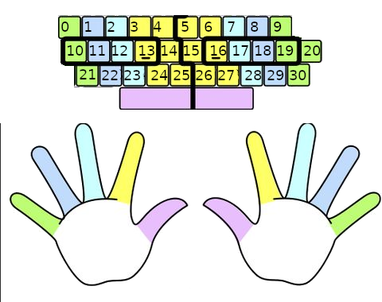

## Assumptions
- 10 finger typing, thumbs on keyboard, each finger is responsible for a set of keys

- Fingers start in positions 10, 11, 12, 13, 16, 17, 18, 19
- When a finger moves, it remains in that position until needed again
  + This may not be accurate to real world typing
- distances on keys are defined as and every pair is reflexive (i.e distances (x,y) = (y, x)):
  + Moving finger horizontally one key (ex. 13->14) has a distance of 1.0
  + Top row to middle row (ex. 0 -> 10) has a distance of 1.031
  + Middle row to bottom row (ex. 10 -> 21) has a distance of 1.031
  + Top row to bottom row (ex. 0 -> 21) has a distance of 2.062
  + Special cases:
    + (4 -> 24), (6 -> 26) has a distance of
    + () has a distance of

